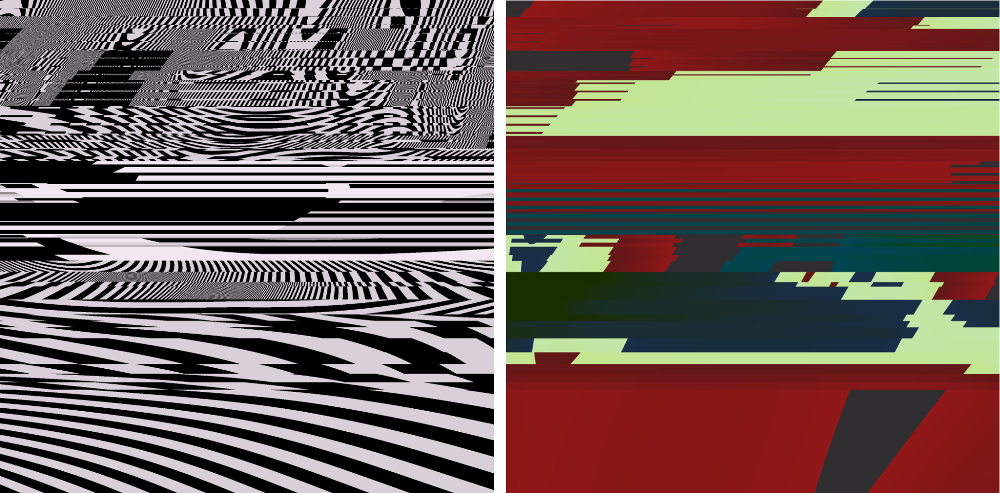
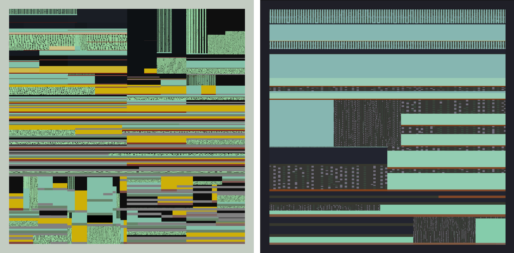
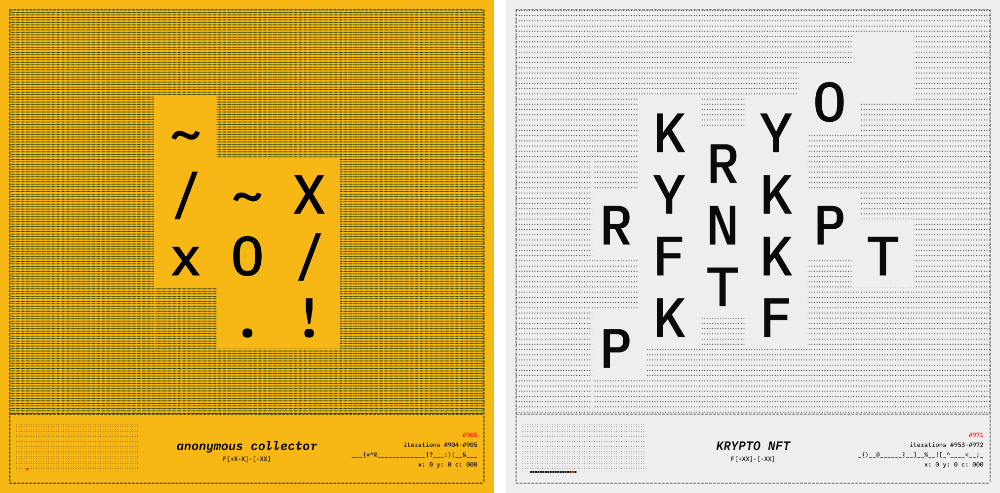
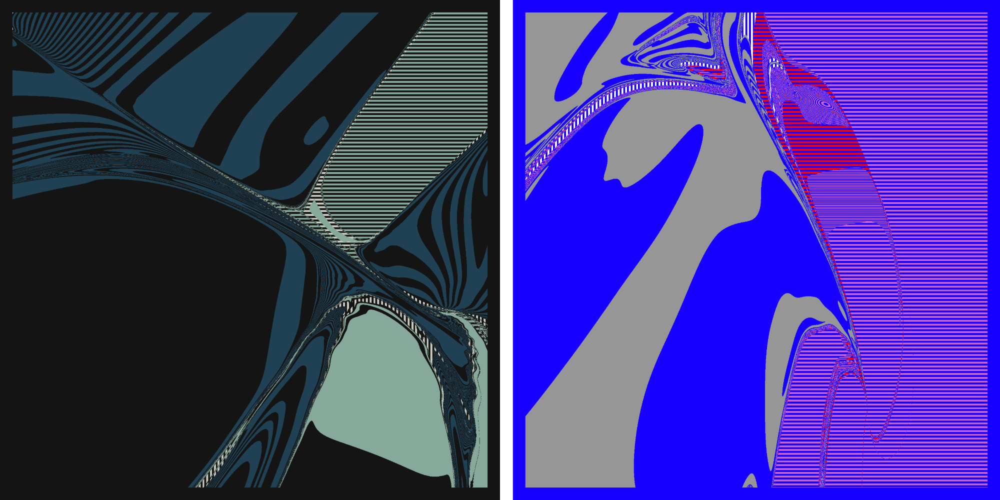
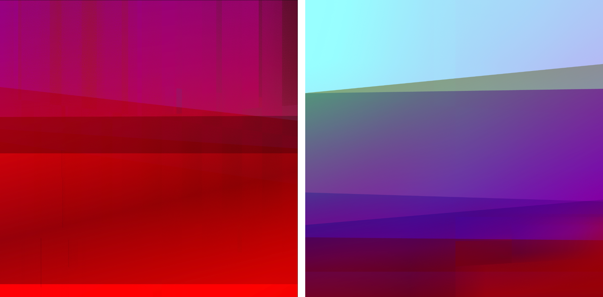
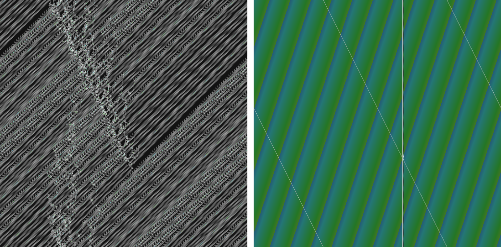
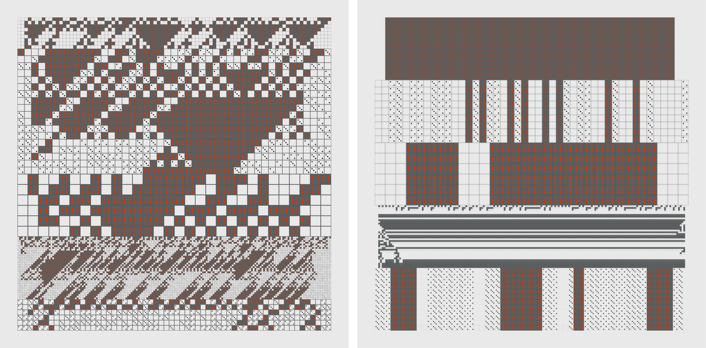
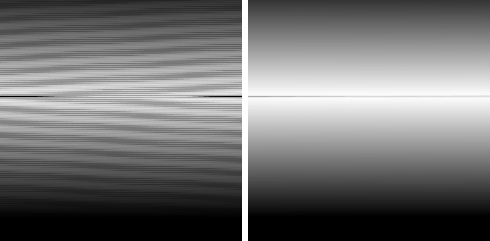

# 0xstc

This page is a curated selection of my long-form generative artworks. In my [artistic exploration and practice](https://stc.github.io/), I delve into the philosophical aspects of computation and the cognitive aspects of the mind. While new technologies emerge and fade rapidly, the overarching purpose — understanding ourselves and our place in the world — remains as crucial as ever. I find it fascinating that humanity invents and explores technological, ritualistic, or artistic tools to frame problems and devise solutions. I'm deeply impressed by our ancestors who developed ways to comprehend our environment and our relationship with reality. I see art as an autonomous expression of the aspects above, that acts as a gateway to our innate nature, aiding in understanding ourselves, our emotions, and our connections with others. 

[_`m0-n0`_](#m0-n0) [_`sh3ll`_](#sh3ll) [_`L-Poem`_](#l-poem) [_`r3s0`_](#r3s0)  [_`C-Life`_](#c-life)  [_`tur1ng`_](#tur1ng) [_`Dotwork`_](#dotwork) [_`moiré`_](#moiré)  

## m0-n0

||||
| ---- | ---- | ---- |
|_2023_| _`GLSL / Javascript / WebAudio / 200 editions / Tezos Blockchain`_||
| |_Appearances: [Tezos South Beach Miami](https://tezos.com/events/art-basel-miami-beach-2023/) (US), [Adaptér Generative Kiosk](https://www.instagram.com/p/C1fmoexNEYG/?img_index=1), Budapest (H)_ | |
| |[View full collection](https://www.fxhash.xyz/generative/slug/m0-n0)| |

_m0-n0_ is a realtime generative artwork, composed of deconstructed screen space. The process is based on a recursive noise function, that is altered by low-level manipulations of a fragment shader. The sound synthesis is closely related with the glitches and flaws of the unfolding image architecture. Each colour scheme activates a different set of sound generators and filter modules. The resulting composition is an audiovisual environment that slowly transforms its elements into a blend of auditive sensations and autonomous pixel configurations.

[↑](#[0xstc])

## sh3ll

||||
| ---- | ---- | ---- |
|_2023_| _`Javascript / WebAudio / Open Edition / Ethereum Blockchain (Zora L2)`_||
| |_Appearances: [Mirror.xyz](https://highlight.mirror.xyz/fQiklpbZC-qzkwoGmetWznTTB7A-cUYZ1Yv5drqrxOg) publication with Highlight, [Creative Applications](https://www.creativeapplications.net/nft/sh3ll-agoston-nagy/) Network_ | |
| |[View full collection](https://highlight.xyz/mint/64ef4dc173490a0eb6d63bda)| |

_sh3ll_ is an audiovisual artwork created with code, algorithms and blockchain metadata. The visual structure is inspired by natural processes that can be replicated through computational methods. The sounds are generated on the fly, based on microsound synthesis. The colour palette is changing gradually, according to the iteration number of the minted token. Individual pieces belong to a larger colour transition that can be viewed over the whole series. 

[↑](#0xstc)

## L-Poem

||||
| ---- | ---- | ---- |
|_2023_| _`Javascript / WebAudio / GraphQL / 256 Editions / Tezos Blockchain`_||
| |_Appearances: [MoneyLaB 13 - Krypto, NeMe](https://www.instagram.com/p/Cz_b_IlNTjo/?img_index=1), Limassol (Cyprus), [Tezos Art Communities](https://www.fxhash.xyz/article/tezos-art-communities), [Waiting to be Signed](https://www.fxhash.xyz/article/e63-slow-meta) E63_| |
| |[View full collection](https://www.fxhash.xyz/generative/25977) | |

Metapoetry.

Following the traditions of concrete poetry, cut-up methodology, typewriter art and conceptual experiments, this piece is transforming metadata of generative token [#22568](https://www.fxhash.xyz/generative/22568) into visual poetry. The image structure is built from a randomly selected iteration of _[“L-Template”](https://www.fxhash.xyz/generative/22568)_ by reading the available drawing instructions from its features and combining them with the name of its owner. The arrangement of the letters is based on this formula. This rule also becomes the title of the rendered piece, which can be seen on the bottom of the scene. The titles are supplemented with the names of the collectors, who become co-authors of the final composition. Where there is no registered fx-hash user name for the selected token, “anonymous collector” will be displayed instead as the author. Being an artwork that is built on the features of another token, _L-Poem_ intends to be a meta-token, a quasi-tautological, entangled entity whose existence is ensured by the immutable ledger environment.

[↑](#0xstc)

## r3s0

||||
| ---- | ---- | ---- |
|_2023_| _`GLSL / Javascript / Open Edition / Ethereum Blockchain (Optimism L2)`_||
| |[View full collection](https://highlight.xyz/mint/657191e2452b7c1626dcd551) | |

_r3s0_ is a real-time generative artwork, investigating algorithmic latent space through shapes, colors and slowly transforming movements. As part of my investigation of GLSL fragment shaders, it is based on a recursive noise function that is converted into different combinations of binary pattern fills. The project started out as an experiment with token gating through the [farcaster](https://www.farcaster.xyz/) protocol by setting up access gates for connected friends to mint the first iterations of the token as a free gift. On one hand, _r3so_ goes for invoking resonance in terms of the appearance of the artwork: it resembles the psychedelic graphic language of the 60s, early computer graphics and op-art through the minimalistic, yet vivid visual alterations of the noise function. On the other hand, it is a community experiment, where members of a decentralized community vibe and resonate together: how such social activities might unfold in the digital space? Custom software, animation, no sound.

[↑](#0xstc)

## C-Life

||||
| ---- | ---- | ---- |
|_2023_| _`GLSL / Javascript / WebAudio / 100 Editions / Ethereum Blockchain (Zora L2)`_||
| |_Appearances: [Adaptér Generative Kiosk](https://www.instagram.com/p/C1fmoexNEYG/?img_index=1), Budapest (H)_ | |
| |[View full collection](https://highlight.xyz/mint/65578131d331aab0373ccd56) | |

_C-Life_ is an audiovisual artwork featuring abstract, generative landscapes. The visual setting comprises a light source and several vibrant cascading elements arranged in front of this radiant light. The gradual movement of these objects evokes the sensation of an opal-like glass surface, giving the impression that the display is melting due to the warmth emitted by the inner light.In the series, the palette of the landscapes gradually shifts from a small range of colors to a wider array of palette pool along the ids of the tokens. As more pieces are created in a single transaction batch, there's an increase in the speed and quantity of elements moving, resulting in a greater number of layers and sonic vibrations. The letter _“C”_ pronounced as _“sea”_ within the title encompasses all words that start with the letter _“C”_. This compression allows for an expansive and limitless range of interpretations for the scene.
[↑](#0xstc)

## tur1ng

||||
| ---- | ---- | ---- |
|_2022_| _`Javascript / WebAudio / 300 Editions / Tezos Blockchain`_||
| |_Appearances: [Game No Game](https://jateknemjatek.c3.hu/#kiallitas_en) Exhibition of C3 Foundation, Deak 17 Gallery, Budapest (H), [Space](https://www.fxhash.xyz/article/extending-a-generative-token-in-the-hybrid-space) Exhibition, M21 Gallery, Pécs (H), [Generative Art Systems](https://www.fxhash.xyz/article/generative-art-systems-an-epistemological-approach), [(Un)wavering Conviction](https://www.fxhash.xyz/article/e39-(un)wavering-conviction) E39_ | |
| |[View full collection](https://www.fxhash.xyz/generative/7578)  | |

_tur1ng_ consists of audible image architectures based on the principle of Turing machines. These systems are mathematical models of computation that manipulate symbols on a strip of tape according to a table of rules. The machine first writes a symbol in a cell on the tape, then either moves the tape one cell left or right, then, based on the observed symbol and the machine's own state in the table, either proceeds to another instruction or halts computation. In _tur1ng_, rules are stored as colors and the original tape cells are constructed from a two dimensional array. The sound unfolds as the algorithm proceeds: monitoring these binary songs requires being attentive to changes in the state or behavior of the system over time so that appropriate interventions or other process-related activities may be carried out. Another feature of listening algorithms is that it often has to be done as a background or secondary task or, perhaps, in parallel with one or more other primary tasks.

[↑](#0xstc)

## Dotwork

||||
| ---- | ---- | ---- |
|_2022_| _`Javascript / WebAudio / 256 Editions / Tezos Blockchain`_||
| |_Appearances: [Adaptér Generative Kiosk](https://www.instagram.com/p/C1fmoexNEYG/?img_index=1), Budapest (H), [Waiting to be Signed](https://www.fxhash.xyz/article/e70-milady's) E70_| |
| |[View full collection](https://www.fxhash.xyz/generative/slug/dotwork) | |

A Cellular Dice Piece.

Dice are small, throwable objects with marked sides that can rest in multiple positions. They are used for generating random numbers, commonly as part of tabletop games, including dice games, board games, role-playing games, and games of chance. A traditional die is a cube with each of its six faces marked with a different number of dots (pips) from one to six. When thrown or rolled, the die comes to rest showing a random integer from one to six on its upper surface, with each value being equally likely. These tools were often used when a decision required to outsource human subjective elements into an objective environment. _Dotwork_ is displaying different rules of elementary cellular automation in the shape of variable dice constellations.

[↑](#0xstc)

## moiré

||||
| ---- | ---- | ---- |
|_2021_| _`Javascript / 33 Editions / Tezos Blockchain`_||
| |_Appearances: [Waiting to be Signed](https://www.fxhash.xyz/article/e39-(un)wavering-conviction) E39_ | |
| |[View full collection](https://www.fxhash.xyz/generative/892) | |

_moiré_ is my genesis long-form generative artwork on the blockchain.

[↑](#0xstc)