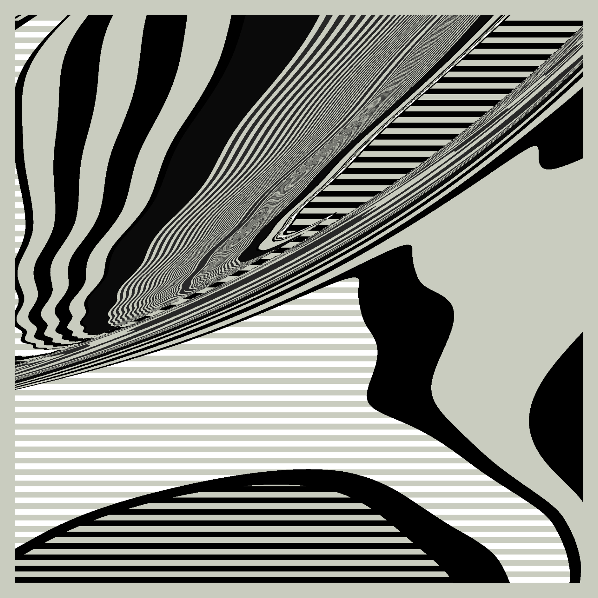

# generative art

_`coding, algorithmic art, workshops`_ 

## Contents

- [About](#about)
- [Limitations](#limitations)
- [Todo](#todo)

## About

The art & the projects
.
.
.
.
.
.
|       hello                 |               |
| --- | --- |

|  | Some info on r3s0  | 
| --- | --- |

| Command | Description |
| --- | --- |
| `git status` | List all *new or modified* files |
| `git diff` | Show file differences that **haven't been** staged |

## Limitations

- **Local Development** - since the site uses XMLHttpRequest to grab content, a local web server will be needed if you want to test things locally, e.g. `python -m http.server`. However, editing files directly on a server/GitHub is part of the convenience/fun.

## Todo

- add descriptions & artworks
