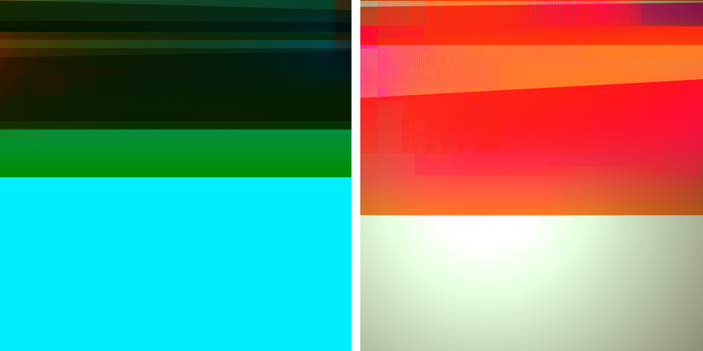

# 0xstc

[_`r3s0`_](#r3s0), [_`C-Life`_](#C-Life) 

## r3s0
| | | |
| ---- | ---- | ---- |
|||
|_`2023`_| _`Custom Software, WebGL`_||
| |project link | |
| |appearances | |
||r3s0 is a real-time generative artwork, investigating algorithmic shapes, colors and slowly transformic movements. As I am primarily interested in the philosophical aspects of computation (entropy, simulations, time, etc.), this piece focuses on the visual aspects of a custom, recursive noise function.||

## C-Life
| | | |
| ---- | ---- | ---- |
|||
|_`2023`_| _`Custom Software, WebGL`_||
| |project link | |
| |appearances | |
||C-Life is an audiovisual artwork featuring abstract, generative landscapes. The visual setting comprises a light source and several vibrant cascading elements arranged in front of this radiant light. The gradual movement of these objects evokes the sensation of an opal-like glass surface, giving the impression that the display is melting due to the warmth emitted by the inner light.In the series, the palette of the landscapes gradually shifts from a small range of colors to a wider array of palette pool along the ids of the tokens. As more pieces are created in a single transaction batch, there's an increase in the speed and quantity of elements moving, resulting in a greater number of layers and sonic vibrations. The letter “C” pronounced as “sea” within the title encompasses all words that start with the letter “C”. This compression allows for an expansive and limitless range of interpretations for the scene.||

